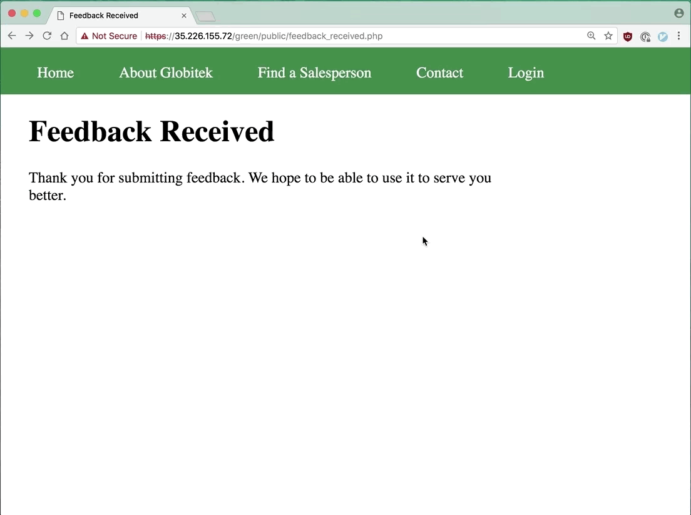
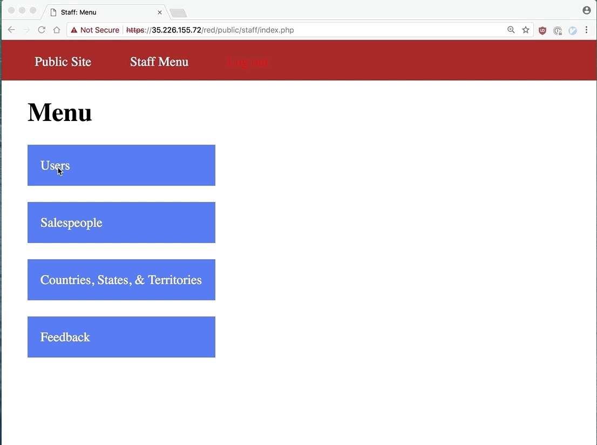

# Project 8 - Pentesting Live Targets

Time spent: **10** hours spent in total

> Objective: Identify vulnerabilities in three different versions of the Globitek website: blue, green, and red.

The six possible exploits are:
* Username Enumeration
* Insecure Direct Object Reference (IDOR)
* SQL Injection (SQLi)
* Cross-Site Scripting (XSS)
* Cross-Site Request Forgery (CSRF)
* Session Hijacking/Fixation

Each version of the site has been given two of the six vulnerabilities. (In other words, all six of the exploits should be assignable to one of the sites.)


## Blue

**Vulnerability #1:** Session Hijacking

1. An attacker can obtain the session id of a logged on user by many means (XSS or sniffing WiFi packets, for example). Here, we use Burp to get the user's PHPSESSID. 
   
2. Then, the attacker can use cURL from the command line to forge a GET request with such session id. Here, the command ```curl --insecure --cookie "PHPSESSID=6f4i5sk14cdrjtotdvdu8lmjd5" --request GET https://35.226.155.72/blue/public/staff/index.php``` is issued.   
  
3. The same attacker could also use its web browser to gain access to the staff area. Google Chrome allows to change a page’s cookies through the console. Below, ```document.cookie="PHPSESSID=6f4i5sk14cdrjtotdvdu8lmjd5"``` is typed in the console.  
  

<br>

**Vulnerability #2:** SQL Injection (SQLi)

The site's ```/blue/public/salesperson.php``` page is vulnerable to SQL injection via the ```id``` parameter. This vulnerability was discovered with sqlmap. The exact command typed below is ```sqlmap -u https://35.226.155.72/blue/public/salesperson.php\?id\=1 --dbs --threads=1 --random-agent --no-cast```. In this attack, sqlmap is able to identify all available databases in the site. The complete output is saved in [log](./blue/sqli/log).   


 
## Green

**Vulnerability #1:** Stored Cross-Site Scripting (XSS)

1. An attacker injects script as a feedback comment in the *Contact Us* form.  
  
2. When a logged on user loads the feedback page, the script is executed.  
  

<br>

**Vulnerability #2:** Username Enumeration

After failed attempts to log in, the site displays the message "Log in was unsuccessful". For registered users, this message is displayed in boldface. For nonexistent users, however, the message is displayed in regular font. This allows username enumeration. Below, usernames ```jmonroe99``` and ```pperson``` exist, while ```anonymous``` and ```randomaccount``` do not.
 
 


## Red

**Vulnerability #1:** Cross-Site Request Forgery (CSRF)

1. Before the attack this is the user data stored in the site.  
  
2. A logged on user loads a [malicious page](./red/csrf/index.html) carefully crafted by an attacker. This malicious page is hosted in a different server. After the attack, the name and last name of first user is modified.  
  

<br>

**Vulnerability #2:** Insecure Direct Object Reference (IDOR)

1. In the staff area, specifically in the Salespeople page, there is information about a salesman (Testy McTesterson) which is not shown in the public "Find a Salesperson" page.  
  
2. An unauthorized user can manipulate the ```id``` parameter from the salesperson.php page to disclose the private information about Testy McTesterson. When the same is attempted on the blue and green pages, both sites simply reload the page rather than displaying the private information about the salesman.  
  


## Notes

No significant challenges were faced while doing this exercise. However, while I was working I had to refer back to previous weeks in order to review some old attacks.  

